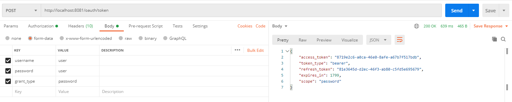

# luizalabs-desafio
> Aplicação desenvolvida a partir do desafio proposto pelo processo seletivo do Magalu

A aplicação tem como intuito expor um endpoint para consulta de CEPs

## Requerimentos
Para construir e rodar a aplicação corretamente, são requisitos:

* [JDK 11](https://www.azul.com/downloads/zulu-community/?package=jdk)
* [Maven 3](https://maven.apache.org/)
* [Docker](https://www.docker.com/products/docker-desktop)

## Exemplos de uso
Ao subir a aplicação localmente, esta expõe o endpoint `GET /api/v1/cep/{cep}` para consulta do CEP informado. É esperado
que a requisição contenha:

* um cabeçalho informando o `Content-Type` como `application/json`
* o verbo http como `GET` 
* o valor do CEP como `PathVariable`
* o CEP contendo 8 digitos, sendo apenas números
* a autenticação via Bearer através do endpoint `POST /oauth/token`, exposto pela própria aplicação
* a autorização para acessar o endpoint de CEP deve conter a role `ADMIN`

Credenciais para geração de autenticação com role `ADMIN`
```
username: admin
password: admin
grant_type: password
```

Credenciais para geração de autenticação com role `USER`
```
username: user
password: user
grant_type: password
```

## Setup para desenvolvimento
Variáveis de ambiente utilizadas no projeto

```
{
    "SERVER_PORT": "8081",
    "LOGGING_LEVEL": "INFO",
    "H2_USERNAME": "sa",
    "H2_PASSWORD": "",
    "REDIS_HOST": "localhost",
    "REDIS_PORT": "6379",
    "H2_CONNECTION_URL": "jdbc:h2:mem:cep_db",
    "OAUTH2_CLIENT_ID": "magalu",
    "OAUTH2_CLIENT_SECRET": "magalu-secret",
    "API_USERNAME": "username",
    "API_PASSWORD": "password",
    "OAUTH2_TOKEN_EXPIRATION_TIME": "1800",
    "REDIS_CACHE_EXPIRATION_TIME": "30000"
}
```

O arquivo docker utilizado no desenvolvimento do projeto encontra-se na pasta raiz. Para criar o container, basta
executar o comando
```
docker-compose up -d
```

Após as devidas configurações, para subir a aplicação localmente, basta executar os seguintes passos
```
mvn clean package
java -jar /path/to/jar/cep-1.0.1-SNAPSHOT.jar -Dlogging.level.ROOT=INFO
```

Para configurar o endpoint de autenticação através do OAuth2, é preciso informar os valores de `OAUTH2_CLIENT_ID` e
`OAUTH2_CLIENT_SECRET` como `Basic Auth`, além de configurar o body da requisição como `form-data` e informar os chaves
`username`, `password` e `grant_type`, respectivamente, como os valores de `OAUTH2_CLIENT_ID`, `OAUTH2_CLIENT_SECRET` e 
'password'. Segue imagem de exemplo: 



Há um arquivo de collection do Postman também na raiz do projeto. Caso opte por utilizá-lo, o arquivo chama-se
`Magalu.postman_collection.json`. Ele contém exemplos de requisições com CEPs válidos e inválidos, endpoint de geração 
de token para roles `USER` e `ADMIN` e endpoint de métricas e saúda da aplicação.

### Relacionado ao desafio
No navegador de sua escolha, é possivel analisar os dados presentes na base de dados em tempo de execução 
através do endpoint `/h2-console`. Os dados de conexão estão presentes nas variáveis de ambiente.

Para análises de saúde, a aplicação também expõe endpoints do `actuator`. Alguns exemplos são `/actuator/metrics` e 
`/actuator/health`

A aplicação usa o Sleuth para estruturação de logs. Caso hajam momentos de chamadas de stress na aplicação, analisar o
log para encontrar possíveis problemas é muito importante, e o Sleuth entra para facilitar esse processo, gerando IDs de
traces de logs, e spans de acordo com a hierarquia definida.

Juntamente ao Sleuth, é possivel analisar as informações referentes a cada requisição com o Zipkin. No navegador de sua 
escolha, ao acessar a URL `http://localhost:9411/zipkin/`, você terá acesso a uma página gráfica para analisar de forma 
centralizada e rápida as requisições da aplicação